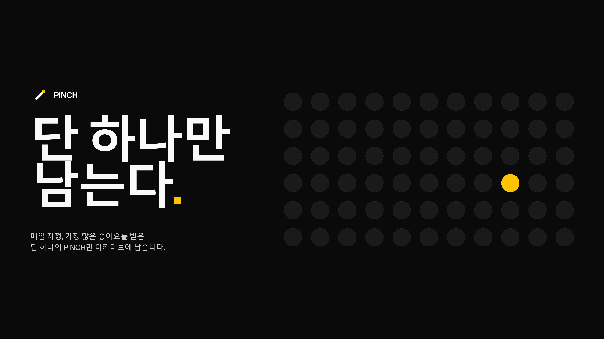
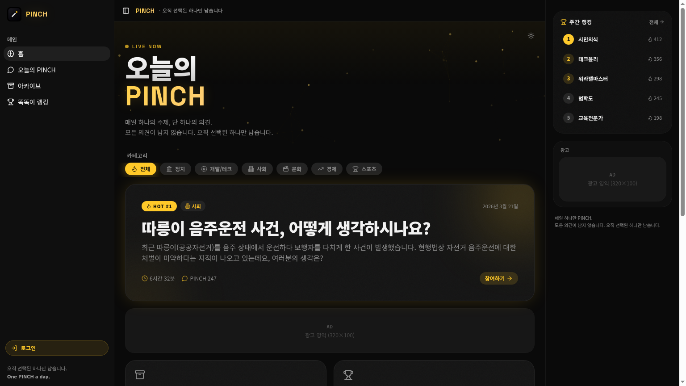
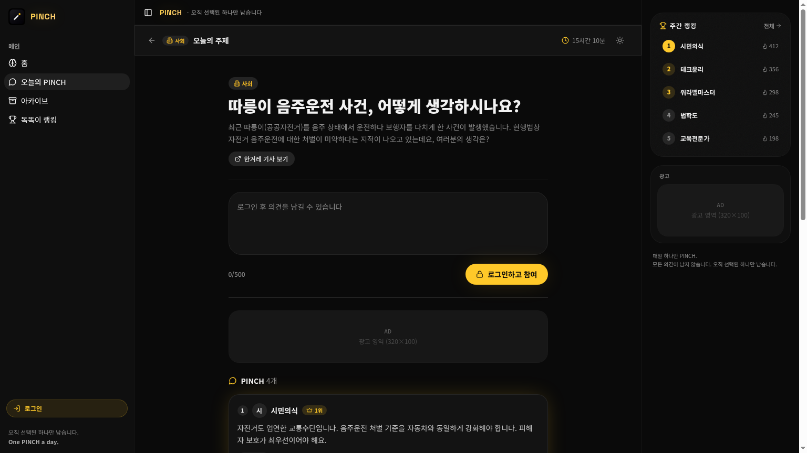
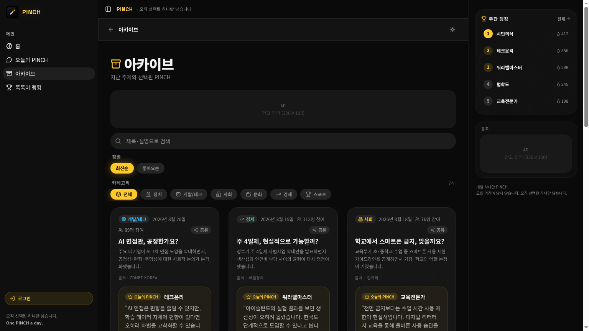
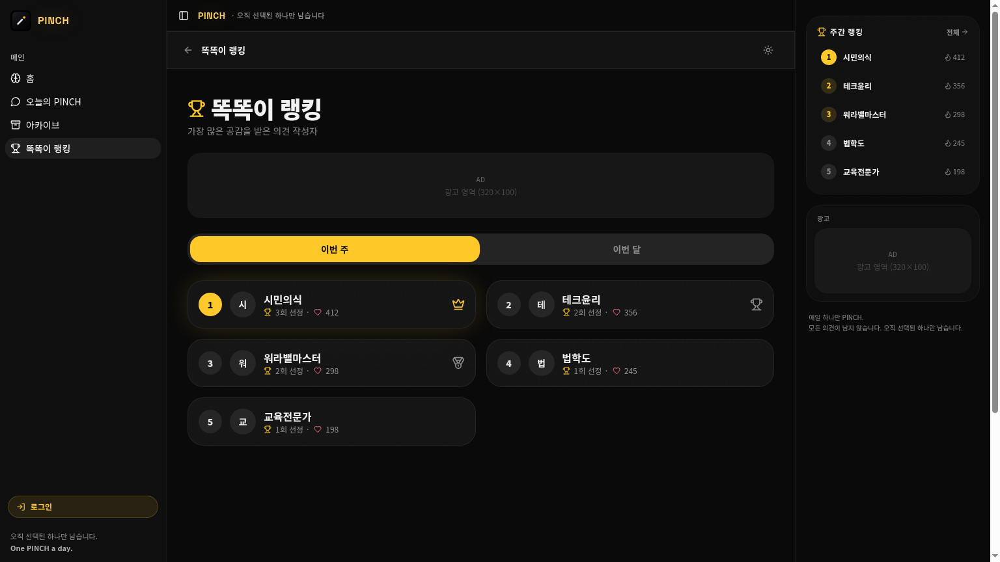

 
 

# PINCH

### 매일 하나의 주제, 단 하나의 의견.

**모든 의견이 남지는 않습니다.** 
**자정이 지나면, 선택받은 하나의 PINCH만 살아남습니다.**

 

 
 

`정치` · `테크` · `사회` · `문화` · `경제` 

---

## What Is PINCH?

**PINCH**는 한국형 일일 토론 플랫폼입니다. 
매일 하나의 토픽이 열리고, 사용자는 하루에 단 하나의 의견만 남길 수 있습니다.

하루가 끝나면 가장 많은 좋아요를 받은 **단 하나의 PINCH**만 아카이브에 남습니다. 
나머지 의견은 흐름 속으로 사라지고, 그날의 대표 의견만 기록됩니다.

> PINCH는 토론을 정리하지 않습니다. 
> 단 하나를 선별합니다.

---

## Product Preview

<table>
<tr>
<td width="50%" align="center">

 
 
<strong>Home</strong>
 
오늘의 HOT 토픽과 카테고리 흐름을 한 화면에서 확인합니다.
</td>
<td width="50%" align="center">

 
 
<strong>Today's PINCH</strong>
 
로그인 후 하루에 단 하나의 의견만 남길 수 있습니다.
</td>
</tr>
<tr>
<td width="50%" align="center">

 
 
<strong>Archive</strong>
 
지난 토픽과 그날 살아남은 PINCH를 검색하고 탐색합니다.
</td>
<td width="50%" align="center">

 
 
<strong>Ranking</strong>
 
주간/월간 기준으로 가장 많이 선택받은 사용자를 보여줍니다.
</td>
</tr>
</table>

---

## Core Rules

<table>
<tr>
<td width="25%" align="center">
<h3>01</h3>
<strong>하루 1 PINCH</strong>
 
KST 자정 기준으로 작성 가능 상태가 갱신됩니다.
</td>
<td width="25%" align="center">
<h3>02</h3>
<strong>단 하나만 생존</strong>
 
가장 많은 좋아요를 받은 의견만 아카이브됩니다.
</td>
<td width="25%" align="center">
<h3>03</h3>
<strong>카테고리별 토픽</strong>
 
정치, 테크, 사회, 문화, 경제, 스포츠를 다룹니다.
</td>
<td width="25%" align="center">
<h3>04</h3>
<strong>똑똑이 랭킹</strong>
 
선정 횟수와 누적 좋아요를 기준으로 집계합니다.
</td>
</tr>
</table>

---

## Daily Flow

| Time | Experience |
| :-- | :-- |
| 00:00 KST | 새로운 토픽이 열리고 참여 상태가 초기화됩니다. |
| During the day | 사용자는 하나의 PINCH를 남기고 다른 의견에 좋아요를 누릅니다. |
| Before midnight | 실시간 카운트다운과 참여 현황이 화면에 반영됩니다. |
| After midnight | 가장 많은 좋아요를 받은 PINCH 하나가 아카이브됩니다. |

---

## Service Tone

PINCH는 빠르게 소비되는 댓글창보다 더 압축된 토론 경험을 지향합니다.

- **가볍게 참여하되, 선택은 무겁게**
- **많이 말하기보다 하나를 남기기**
- **오늘의 분위기를 내일의 기록으로 보존하기**

---

## One PINCH a Day

**PINCH** 
_매일 하나의 주제, 단 하나의 의견._

 

[**pinch.kr**](https://pinch.kr)

 
 

© 2026 PINCH. Built in Korea.

